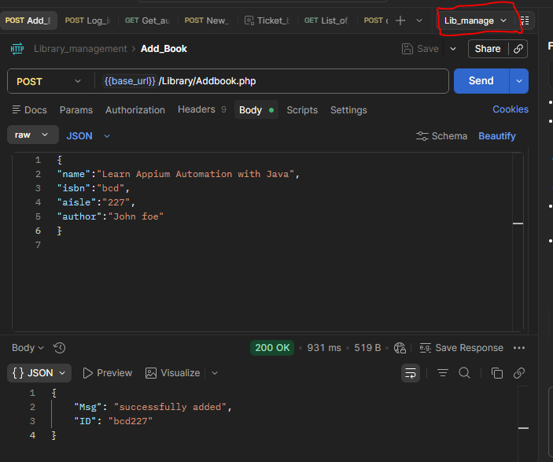
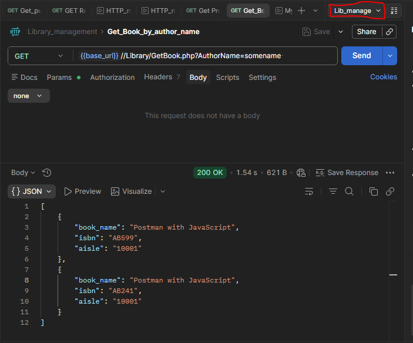
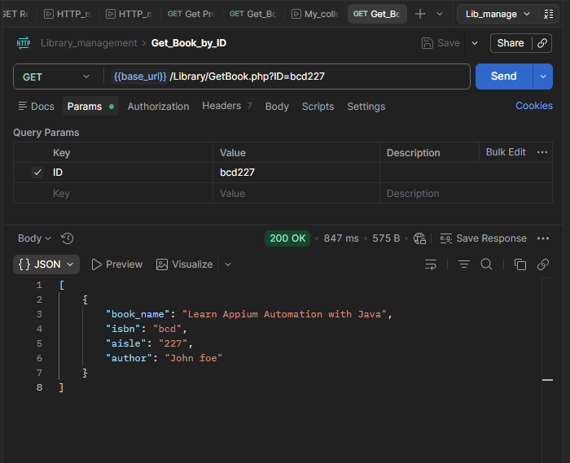
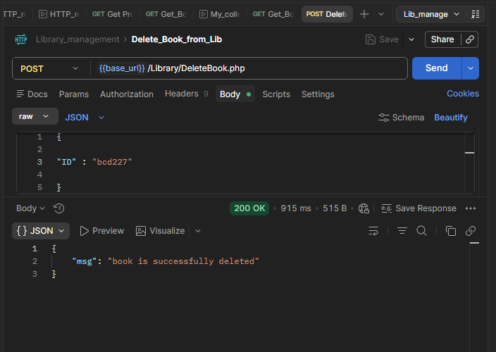

# Library Management API Testing Project

## Overview

This project demonstrates API testing using Postman for a simple Library Management System.

The collection includes API requests for:

* Adding books to the library
* Retrieving books by author name
* Retrieving books by id
* Deleting books from the library

The project was created to practice REST API testing concepts including:

* HTTP methods
* Request and response validation
* Status code verification
* JSON response handling
* CRUD operations
* API automation basics

---

# Tools Used

* Postman
* REST APIs
* JSON


---
# Environment setup
First of all set the below environment for this project:


* This environment variable can be called at any time in the project wherever required to call the website address.
* Never forget to select the correct environment for the particular project

---

# API Endpoints Tested

## 1. Add Book

### Method

`POST`

### Description

Adds a new book to the library database.

### Sample Endpoint

```http
{{base_url}}/Library/Addbook.php
```

### Sample Request Body

```json
{
"name":"Learn Appium Automation with Java",
"isbn":"bcd",
"aisle":"227",
"author":"John foe"
}

```

### Expected Response

* Status Code: `200 OK`
* Book successfully added



---

## 2. Get Book by Author Name

### Method

`GET`

### Description

Fetches books written by a specific author.

### Sample Endpoint

```http
{{base_url}}//Library/GetBook.php?AuthorName=somename 
```

### Expected Response

* Status Code: `200 OK`
* Returns list of books by author



---

## 3. Get Book By ID

### Method

`GET`

### Description

Retrieves details of a specific book.

### Sample Endpoint

```http
{{base_url}}/Library/GetBook.php?ID=bcd227
```
### Parameters

```http
ID (Key) = bcd227 (Value)
```

### Expected Response

* Status Code: `200 OK`
* Returns book information



---

## 4. Delete Book

### Method

`POST`

### Description

Deletes a book from the library.

### Sample Endpoint

```http
{{base_url}}/Library/DeleteBook.php
```

### Sample Request Body

```json
{
 
"ID" : "bcd227"
 
}
```

### Expected Response

* Status Code: `200 OK`
* Book successfully deleted



---

# Test Scenarios Covered

* Valid API requests
* Response assertions
* Status code verification
* CRUD operation testing
* JSON request body handling
* API workflow testing
* REST API testing
* Postman collections
* API request chaining
* Request validation

---

# Author
Created by Archana Dubey
