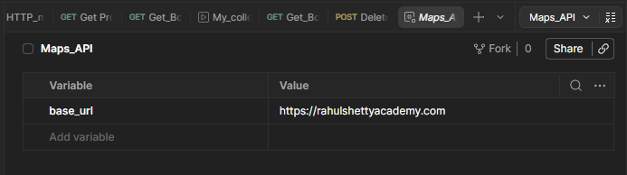
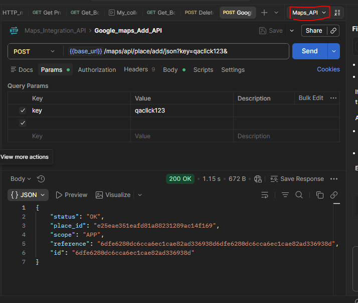
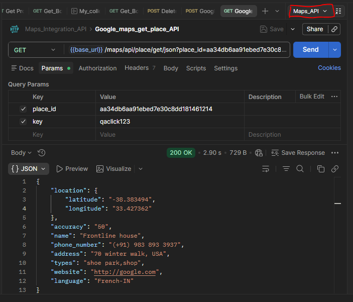
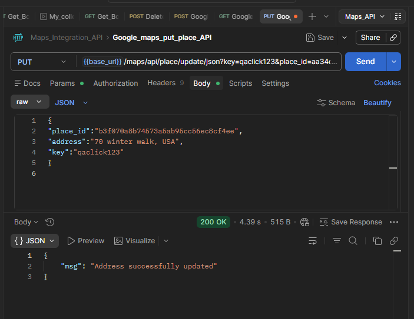
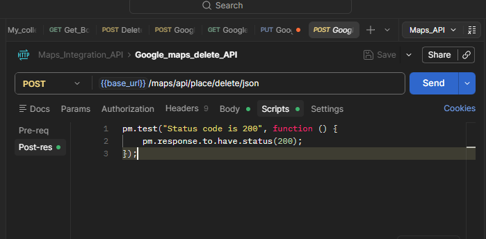
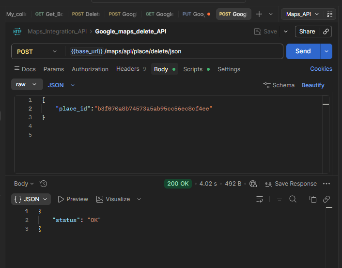

# Google Maps API Testing Project

## Overview

This project demonstrates API testing using Postman for Google Maps Integration APIs testing.

The project includes testing of CRUD operations for map locations and places using REST APIs.

The collection contains:

* Add Place API
* Get Place API
* Update Place API
* Delete Place API

This project was created to practice:

* REST API testing
* CRUD operations
* Request and response validation
* JSON handling
* Chained API requests
* Environment variables in Postman

---

# Tools Used

* Postman
* REST APIs
* JSON

---
# Environment setup
Set the below environment for this project:



---
# API Endpoints Tested

## 1. Add Place API

### Method

`POST`

### Description

Adds a new place to Google Maps.

### Sample Endpoint

```http id="30md84"
{{base_url}}/maps/api/place/add/json?key=qaclick123&
```
### Parameters

key = qaclick123

### Sample Request Body

```json id="m7c7bi"
{
  "location": {
    "lat": -38.383494,
    "lng": 33.427362
  },
  "accuracy": 50,
  "name": "Frontline house",
  "phone_number": "(+91) 983 893 3937",
  "address": "29, side layout, cohen 09",
  "types": [
    "shoe park",
    "shop"
  ],
  "website": "http://google.com",
  "language": "French-IN"
}
```

### Expected Response

* Status Code: `200 OK`
* Place added successfully
* Place ID generated



---

## 2. Get Place API

### Method

`GET`

### Description

Retrieves details of a specific place using Place ID.

### Parameters

place_id = aa34db6aa91ebed7e30c8dd181461214
key = qaclick123

### Sample Endpoint

```http id="2ezx62"
{{base_url}}/maps/api/place/get/json?place_id=aa34db6aa91ebed7e30c8dd181461214
```

### Expected Response

* Status Code: `200 OK`
* Returns place details


---

## 3. Update Place API

### Method

`PUT`

### Description

Updates address details of an existing place.

### Parameters

place_id = aa34db6aa91ebed7e30c8dd181461214
key = qaclick123

### Sample Endpoint

```http id="v2z7ka"
{{base_url}}/maps/api/place/update/json?key=qaclick123&place_id=aa34db6aa91ebed7e30c8dd181461214
```

### Sample Request Body

```json id="6j9wuv"
{
  "place_id":"b3f070a8b74573a5ab95cc56ec8cf4ee",
  "address":"70 winter walk, USA",
  "key":"qaclick123"
}

```

### Expected Response

* Status Code: `200 OK`
* Place updated successfully



---

## 4. Delete Place API

### Method

`POST`

### Description

Deletes an existing place from Google Maps.

### Sample Endpoint

```http id="4j6t2e"
{{base_url}}/maps/api/place/delete/json
```

### Sample Request Body

```json id="l3f1yj"
{
    "place_id":"f6eccdbe3f096297d8415c5d44292a33"
}

```

### Sample Script Body
```json id="l3f1yj"

pm.test("Status code is 200", function () {
    pm.response.to.have.status(200);
});
```


### Expected Response

* Status Code: `200 OK`
* Place deleted successfully



---

# CRUD Operations Covered

| Operation | API              |
| --------- | ---------------- |
| Create    | Add Place API    |
| Read      | Get Place API    |
| Update    | Update Place API |
| Delete    | Delete Place API |

---

# Test Scenarios Covered

* Valid API requests
* CRUD operation testing
* Status code validation
* JSON response validation
* Chained request execution
* Dynamic Place ID handling
* Request body validation

---

# Postman Features Used

* Collections
* Environment Variables
* Pre-request Scripts
* Test Scripts
* Collection Runner

---

# Learning Outcomes

Through this project, I practiced:

* REST API testing
* CRUD operations
* API automation basics
* Dynamic data handling
* Chained API execution
* Request and response validation

---

# Author

Created by Archana Dubey
