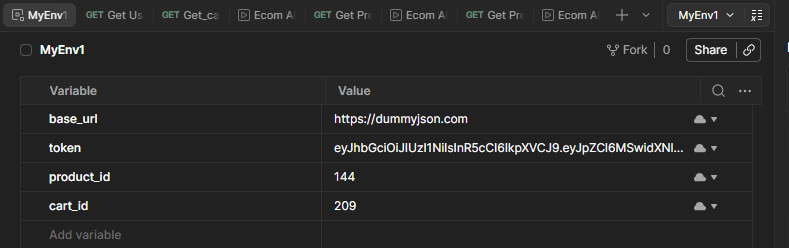
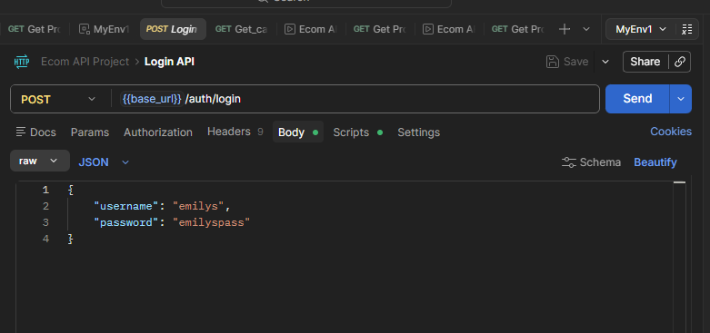
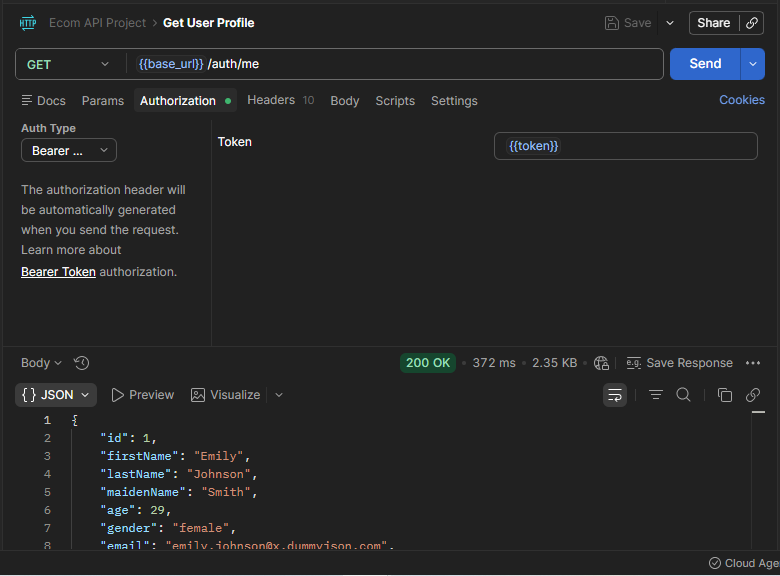
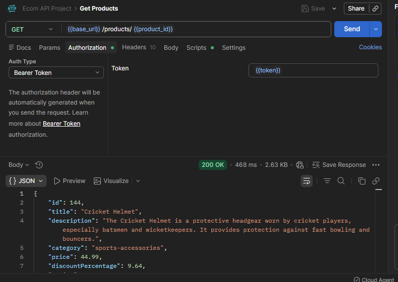
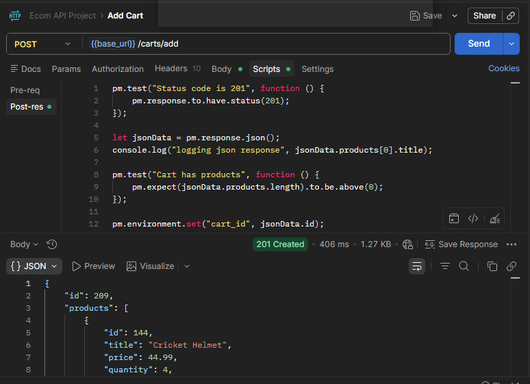
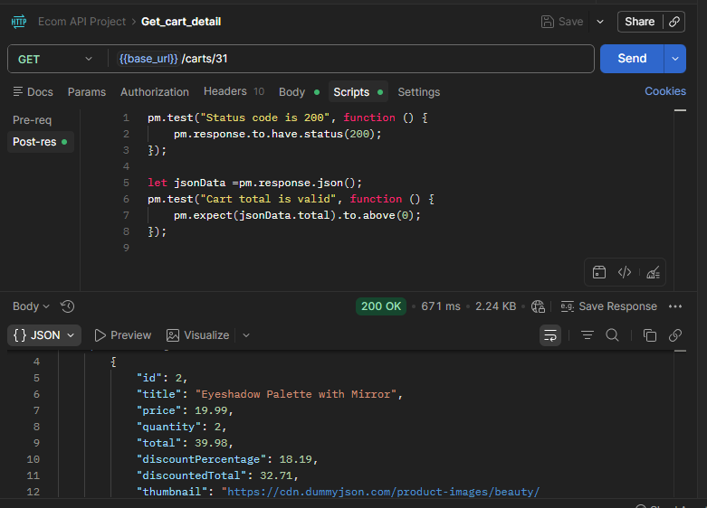

# Postman_testing
## E-commerce website API testing

----

### Pre-requisites
Base URL = https://dummyjson.com
#### Environment variables



----

Case 1.1: Success - Valid Credentials
- Verify user with authentic UserId and Password 
- Returns a 200 and Token.

### Script
```
let jsonData = pm.response.json();
pm.environment.set("token",jsonData.accessToken);
console.log(pm.environment.get("token"));
```
### Body
```commandline
{
    "username": "emilys",
    "password": "emilyspass"
}
```
### Method
```commandline
POST
```
Endpoint: {{base_url}}/auth/me



----
Case 1.2: Get User Profile
- Get the details of verified and logged in user

### Method
```commandline
GET
```
Endpoint: {{base_url}}/auth/me
Authorization: Bearer {{accessToken}}




Case 1.3: Get Products
- Get the description of the product. Id no.= 144

### Script
```
pm.test("Status code is 200", function () {
    pm.response.to.have.status(200);
});

let jsonData = pm.response.json();
console.log(jsonData.id)
pm.environment.set("product_id",jsonData.id)

```

### Method
```commandline
GET
```
Endpoint: {{base_url}}/products/{{product_id}}
Authorization: Bearer {{accessToken}}



----
Case 1.4: Add products to cart
- Add selected product to the cart


### Script
```
pm.test("Status code is 201", function () {
    pm.response.to.have.status(201);
});

let jsonData = pm.response.json();
console.log("logging json response", jsonData.products[0].title);

pm.test("Cart has products", function () {
    pm.expect(jsonData.products.length).to.be.above(0);
});

pm.environment.set("cart_id", jsonData.id);
```

### Body
```commandline
{
    "userId": 1,
        "products": [
        {
            "id": {{product_id}},
            "quantity": 4
        }
        ]
}
```

### Method
```commandline
POST
```
Endpoint: {{base_url}}/carts/add



----

Case 1.5: Get cart detail
- Get the description of the product added to the cart
### Script
```
pm.test("Status code is 200", function () {
    pm.response.to.have.status(200);
});

let jsonData =pm.response.json();
pm.test("Cart total is valid", function () {
    pm.expect(jsonData.total).to.above(0);
});

```

### Body
```commandline
{
    "userId": 1,
        "products": [
        {
            "id": {{product_id}},
            "quantity": 4
        }
        ]
}
```

### Method
```commandline
GET
```
Endpoint: {{base_url}}/carts/31




