# Ticket Booking API Testing Project

## Overview

This project demonstrates end-to-end API testing using Postman for a Ticket Booking Management System.

The project includes testing of:

* User authentication APIs
* Event management APIs
* Ticket booking APIs
* CRUD operations
* Authorization workflows

The project was created to practice:

* REST API testing
* Request chaining
* Response validation
* Dynamic data handling
* API automation basics
---
# Tools Used

* Postman
* REST APIs
* JSON

---

# Features Tested

## Authentication Module

* User account validation
* User login
* Authenticated user retrieval

## Event Management Module

* Create event
* Get all events
* Get single event
* Update event
* Delete event

## Booking Management Module

* Create booking
* Get all bookings
* Get booking by reference ID
* Delete booking

---
# Environment setup
Set the below environment for this project:

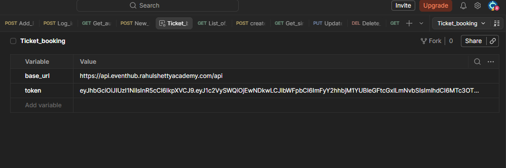

---
# API Endpoints Tested

# 1. User Account Registration

### Method

`POST`

### Description

Validates new user registration with invalid or non-existing credentials.

### Sample Endpoint

```http id="lcbn15"
{{base_url}}/auth/register
```

### Sample Body

```http id="lcbn15"
{
  "email": "archan35a@example.com",
  "password": "secret123"
}
```

### Expected Response

* New user created
* Status Code: `201 OK`

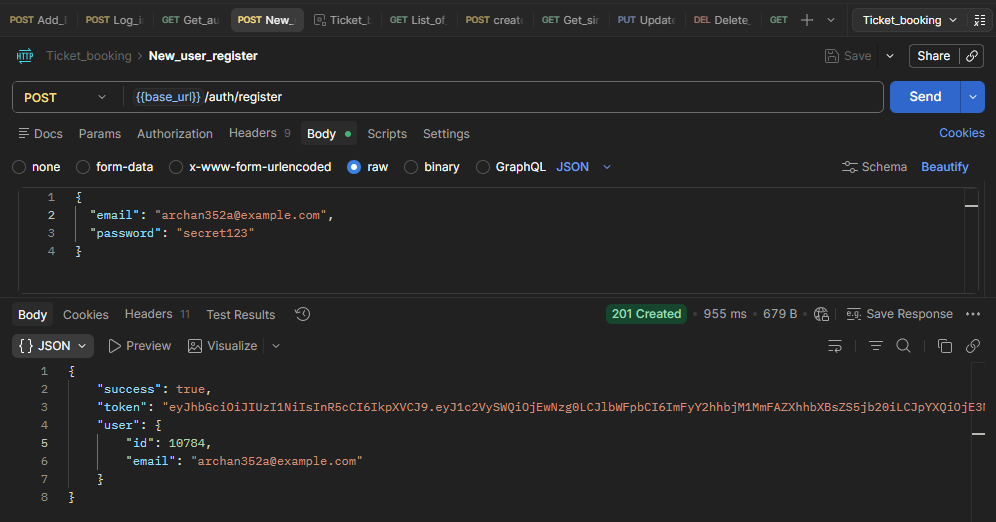

---

# 2. User Login

### Method

`POST`

### Description

Logs in user with valid existing credentials.

### Sample Endpoint

```http id="k8i8p6"
{{base_url}}/auth/login
```
### Sample Body

```http id="lcbn15"
{
  "email": "archan35a@example.com",
  "password": "secret123"
}
```

### Expected Response

* Status Code: `200 OK`
* Authentication token generated

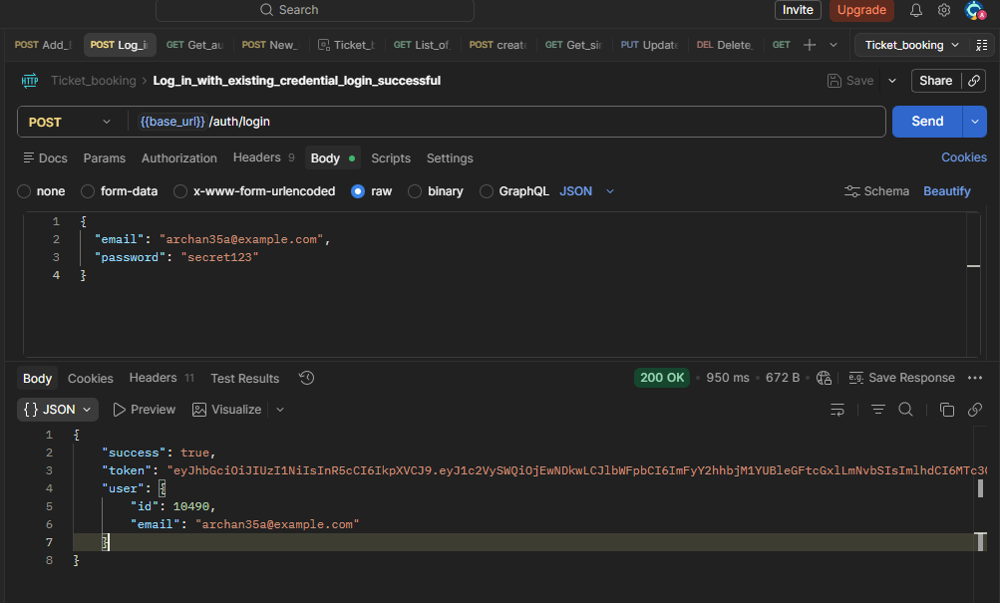

---

# 3. Get Authenticated User

### Method

`GET`

### Description

Fetches authenticated user profile details.

### Sample Endpoint

```http id="p8a3e1"
{{base_url}}/auth/me
```

### Sample Authorization

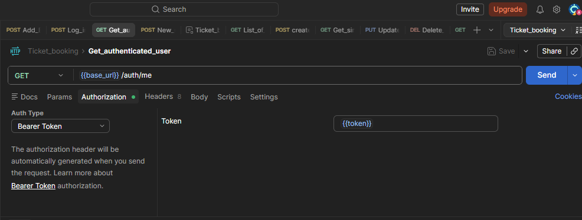

### Expected Response

* Status Code: `200 OK`
* User details returned

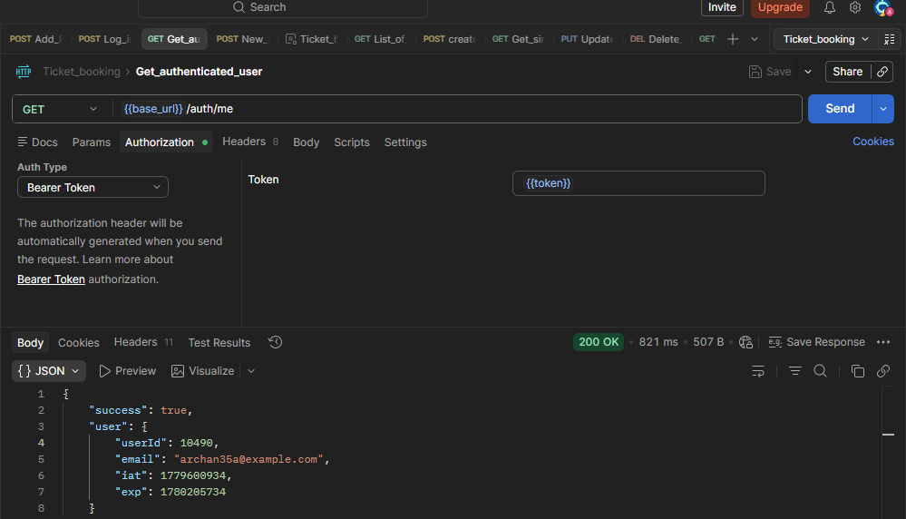

---

# 4. Create New Event

### Method

`POST`

### Description

Creates a new event.

### Sample Endpoint

```http id="it2d2e"
{{base_url}}/events
```
### Sample Authorization

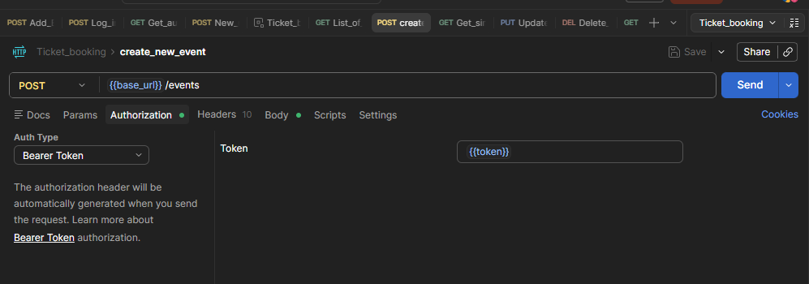


### Sample Body

```http id="it2d2e"
{
  "title": "Tech Summit 2026",
  "description": "A premier technology conference.",
  "category": "Conference",
  "venue": "Bangalore International Centre",
  "city": "Bangalore",
  "eventDate": "2026-06-15T09:00:00.000Z",
  "price": 1500,
  "totalSeats": 500,
  "imageUrl": "https://example.com/banner.jpg"
}
```

### Expected Response

* Event created successfully
* Status Code: `201 Created`

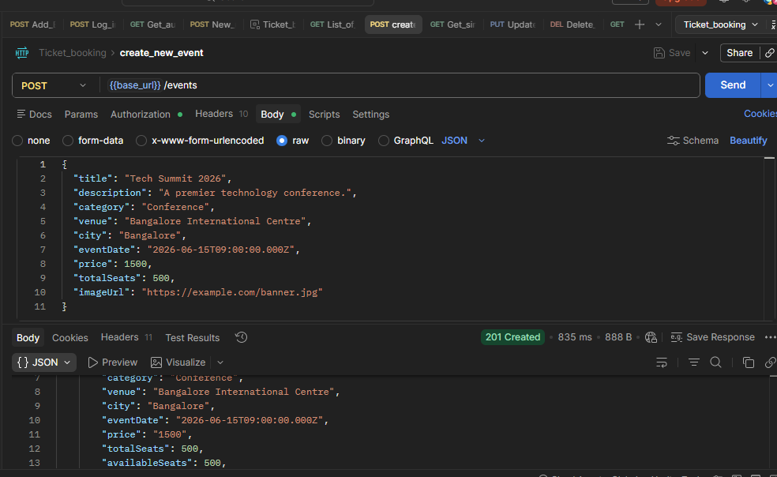
---

# 5. Get List of Events

### Method

`GET`

### Description

Fetches all available events.

### Sample Endpoint

```http id="e0pjpq"
https://api.eventhub.rahulshettyacademy.com/api/events
```

### Authorization
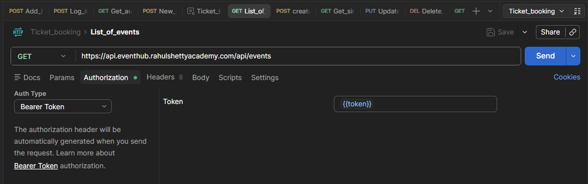

### Expected Response

* Status Code: `200 OK`
* List of events returned

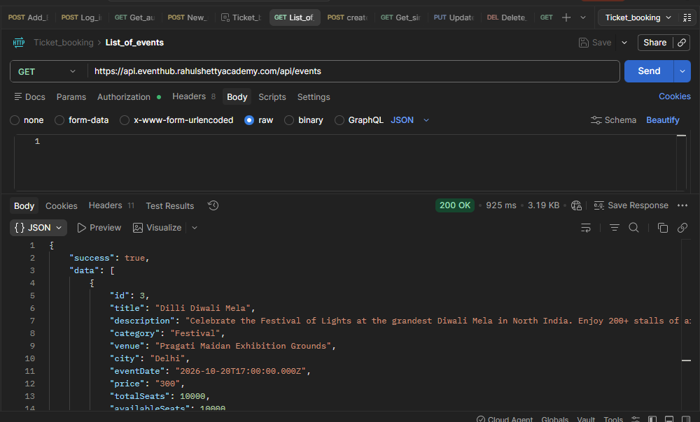

---

# 6. Get Single Event by ID

### Method

`GET`

### Description

Fetches event details using event ID.

### Sample Endpoint

```http id="z7kl0v"
{{base_url}}/events/1
```

### Authorization
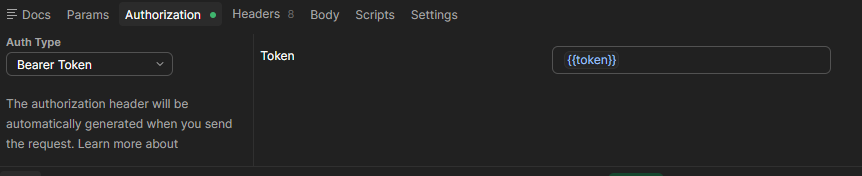


### Expected Response

* Status Code: `200 OK`
* Event details returned

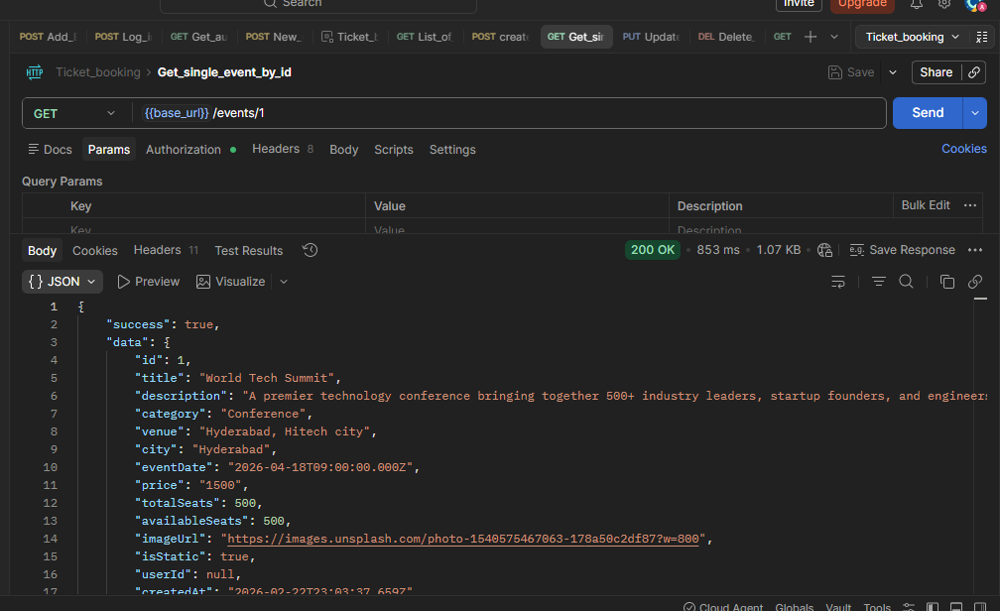

---

# 7. Update Event

### Method

`PUT`

### Description

Updates existing event details.

### Sample Endpoint

```http id="z34z70"
{{base_url}}/events/40148
```

### Authorization
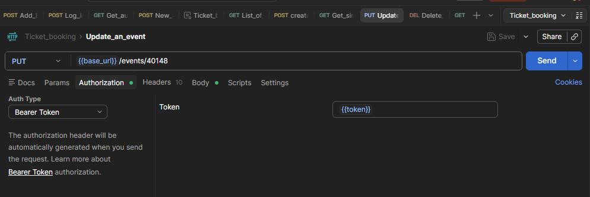

### Sample Body
```commandline
{
  "title": "Tech Summit 2026",
  "description": "A premier technology conference.",
  "category": "Conference",
  "venue": "Bangalore International Centre",
  "city": "Bangalore",
  "eventDate": "2026-06-15T09:00:00.000Z",
  "price": 15000,
  "totalSeats": 5000,
  "imageUrl": "https://example.com/banner.jpg"
}
```

### Expected Response

* Status Code: `200 OK`
* Event updated successfully

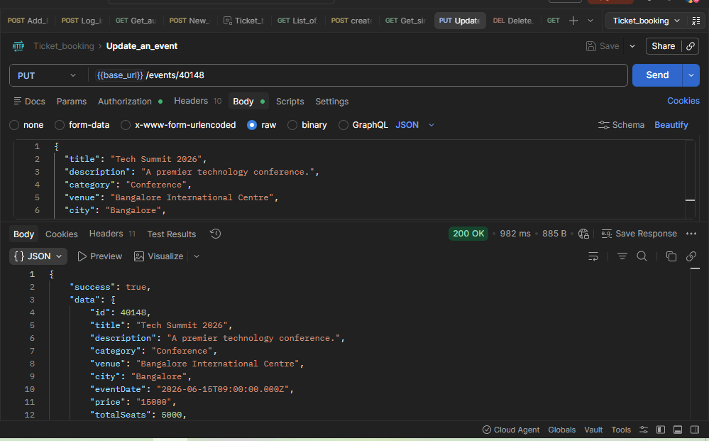

---

# 8. Delete Event

### Method

`DELETE`

### Description

Deletes an existing event.

### Sample Endpoint

```http id="ol0p2y"
{{base_url}}/events/40148
```

### Authorization
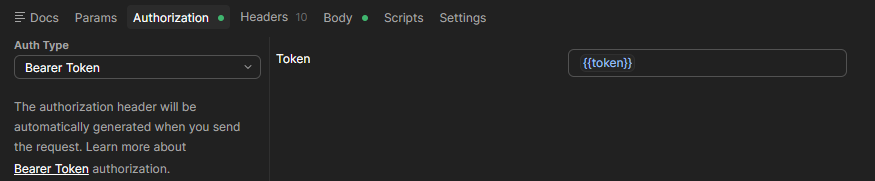
    

### Sample Body
```commandline
{
  "title": "Tech Summit 2026",
  "description": "A premier technology conference.",
  "category": "Conference",
  "venue": "Bangalore International Centre",
  "city": "Bangalore",
  "eventDate": "2026-06-15T09:00:00.000Z",
  "price": 15000,
  "totalSeats": 5000,
  "imageUrl": "https://example.com/banner.jpg"
}


```

### Expected Response

* Status Code: `200 OK`
* Event deleted successfully


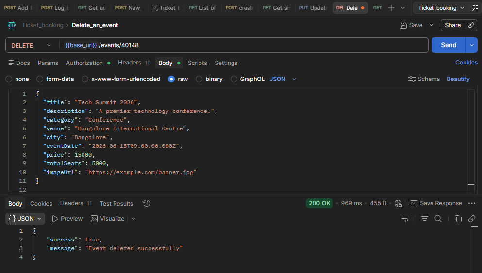

---

# 9. Create Booking

### Method

`POST`

### Description

Creates a ticket booking for an event.

### Sample Endpoint

```http id="3u2o9u"
https://api.eventhub.rahulshettyacademy.com/api/bookings
```

### Authorization


### Sample Body
```commandline
{
  "eventId": 1,
  "customerName": "Priya Sharma",
  "customerEmail": "priya.sharma@email.com",
  "customerPhone": "+91-9876543210",
  "quantity": 2
}
```

### Expected Response

* Booking created successfully
* Booking reference ID generated

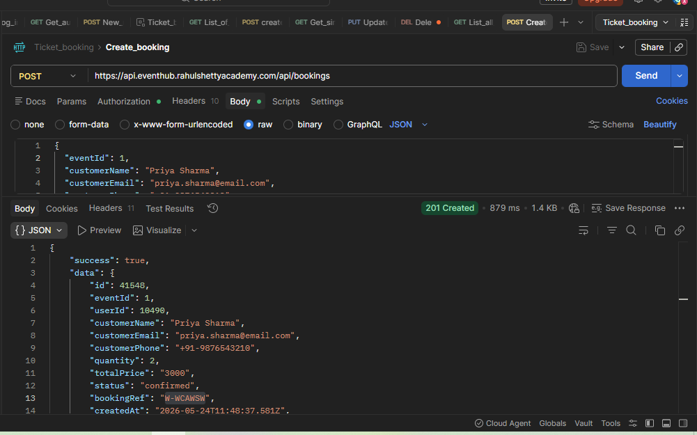

---

# 10. Get a list of All Bookings

### Method

`GET`

### Description

Fetches all bookings.

### Sample Endpoint

```http id="0p0j6f"
https://api.eventhub.rahulshettyacademy.com/api/bookings
```

### Authorization


### Expected Response

* Status Code: `200 OK`
* Booking list returned

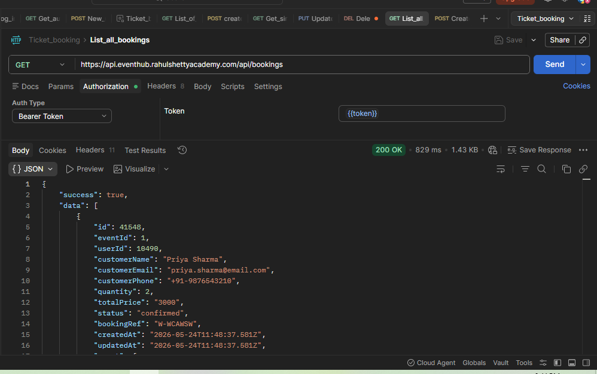

---

# 11. Get Booking by Reference ID

### Method

`GET`

### Description

Retrieves booking details using booking reference ID.

### Sample Endpoint

```http id="o5y3fu"
{{base_url}}/bookings?ref=W-WCAWSW
```
### Parameters
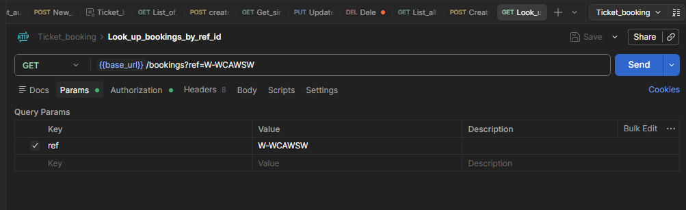

### Authorization


### Expected Response

* Status Code: `200 OK`
* Booking details returned

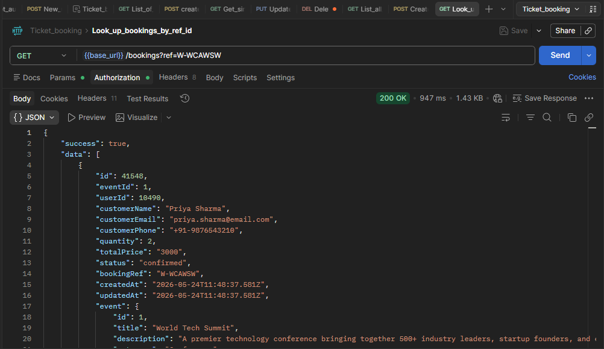

---

# 12. Delete Booking

### Method

`DELETE`

### Description

Deletes an existing booking.

### Sample Endpoint

```http id="5s7rhz"
{{base_url}}/bookings?id=1
```

### Parameters
```commandline
id = 1
```
### Authorization


### Expected Response

* Status Code: `200 OK`
* Booking deleted successfully

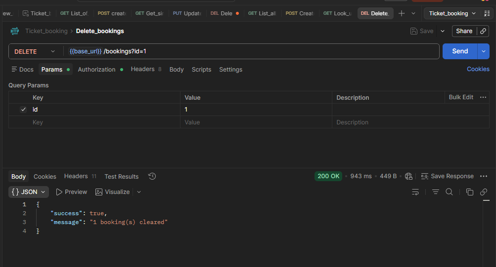

---

# CRUD Operations Covered

| Operation | API                          |
| --------- | ---------------------------- |
| Create    | Create Event, Create Booking |
| Read      | Get Events, Get Bookings     |
| Update    | Update Event                 |
| Delete    | Delete Event, Delete Booking |

---

# Author

Created by Archana Dubey
